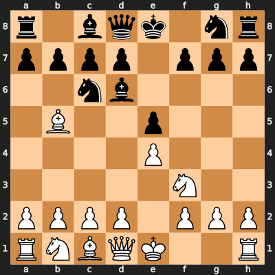

# Godson Ajodo
**CS Guy**

---

### ACTIVE_SESSION: MULTIPLAYER_CHESS
*Shared state session. Any visitor can execute the next move.*

<!-- CHESS-START -->

**SESSION_LOG:** Last move: Nf3. Next turn: Black.

[Play Chess](https://ajodo-godson.github.io/Ajodo-Godson/)
<!-- CHESS-END -->
---

### KERNEL_SPECS
* **Languages:** `Python`, `C/C++`, `Rust`, `SQL`, `TypeScript`, `JavaScript`, `C#`, `KQL`
* **Frameworks:** `React`, `Next.js`, `FastAPI`, `Flask`, `PyTorch`, `TensorFlow`
* **Deep Learning:** `Generative World Models`, `Neural Architectures`, `Image/Video Databases`, `OpenCV`, `Hugging Face`, 
* **Robotics & Systems:** `Robotic Data Pipelines`, `Protocols (BT/Wi-Fi)`, `Docker`, `Kubernetes`, `AWS`, `Azure`, `Teleoperation`,
* **Distributed Infra:** `Spark`, `Hadoop`, `Redis`, `Airflow`, `Vector Similarity Search`

---
`Discord: @Ajoson#7248` | `San Francisco, CA`
